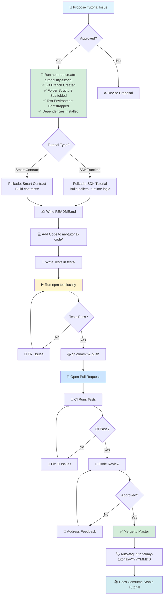

# Tutorial Creation Workflow

This diagram shows the complete workflow for creating and contributing a tutorial to the Polkadot Cookbook.

```mermaid
graph TD
    A[📝 Propose Tutorial Issue] --> B{Approved?}
    B -->|Yes| C["🚀 Run npm run create-tutorial my-tutorial<br/>✅ Git Branch Created<br/>✅ Folder Structure Scaffolded<br/>✅ Test Environment Bootstrapped<br/>✅ Dependencies Installed"]
    B -->|No| Z[❌ Revise Proposal]

    C --> TT{Tutorial Type?}
    TT -->|SDK/Runtime| SDK[ Polkadot SDK Tutorial<br/>Build pallets, runtime logic]
    TT -->|Smart Contract| SC[Polkadot Smart Contract<br/>Build contracts!]

    SDK --> H[✍️ Write README.md]
    SC --> H
    H --> I[💻 Add Code to my-tutorial-code/]
    I --> J[🧪 Write Tests in tests/]

    J --> K[▶️ Run npm test locally]
    K --> L{Tests Pass?}
    L -->|No| M[🔧 Fix Issues]
    M --> K
    L -->|Yes| N[📤 git commit & push]

    N --> O[🔀 Open Pull Request]
    O --> P[🤖 CI Runs Tests]
    P --> Q{CI Pass?}
    Q -->|No| R[🔧 Fix CI Issues]
    R --> P
    Q -->|Yes| S[👀 Code Review]

    S --> T{Approved?}
    T -->|No| U[📝 Address Feedback]
    U --> S
    T -->|Yes| V[✅ Merge to Master]

    V --> W[🏷️ Auto-tag: tutorial/my-tutorial/vYYYYMMDD]
    W --> X[📚 Docs Consume Stable Tutorial]

    style A fill:#e1f5ff
    style C fill:#d4edda
    style K fill:#fff3cd
    style O fill:#cce5ff
    style V fill:#d4edda
    style X fill:#d1ecf1
```
