# Contributing to the Polkadot Cookbook

This guide is for external contributors.

### Tutorial Creation Workflow

```mermaid
graph TD
    A[📝 Propose Tutorial Issue] --> B{Approved?}
    B -->|Yes| C[🚀 Run npm run create-tutorial my-tutorial]
    B -->|No| Z[❌ Revise Proposal]

    C --> D["✅ Git Branch Created<br/>✅ Folder Structure Scaffolded<br/>✅ Test Environment Bootstrapped<br/>✅ Dependencies Installed"]

    D --> H[✍️ Write README.md]
    H --> I[💻 Add Code to my-tutorial-code/]
    I --> J[🧪 Write Tests in tests/]

    J --> K[▶️ Run npm test locally]
    K --> L{Tests Pass?}
    L -->|No| M[🔧 Fix Issues]
    M --> K
    L -->|Yes| N[📤 git commit & push]

    N --> O[🔀 Open Pull Request]
    O --> P[🤖 CI Runs Tests]
    P --> Q{CI Pass?}
    Q -->|No| R[🔧 Fix CI Issues]
    R --> P
    Q -->|Yes| S[👀 Code Review]

    S --> T{Approved?}
    T -->|No| U[📝 Address Feedback]
    U --> S
    T -->|Yes| V[✅ Merge to Master]

    V --> W[🏷️ Auto-tag: tutorial/my-tutorial/vYYYYMMDD]
    W --> X[📚 Docs Consume Stable Tutorial]

    style A fill:#e1f5ff
    style C fill:#d4edda
    style K fill:#fff3cd
    style O fill:#cce5ff
    style V fill:#d4edda
    style X fill:#d1ecf1
```



## 1) Propose your tutorial (required)

- Open an issue using the template: `Tutorial Proposal`.
- Include: learning objectives, audience, prerequisites, tools/versions.
- Wait for approval and a tutorial slug (e.g. `my-tutorial`).

## 2) Create your tutorial using the CLI tool

Run the unified tutorial creator from the repository root:

```bash
npm run create-tutorial my-tutorial
```

This single command will:

- ✅ Create a git branch (`feat/tutorial-my-tutorial`)
- ✅ Scaffold the complete folder structure
- ✅ Bootstrap the test environment
- ✅ Install all necessary dependencies
- ✅ Show you clear next steps

The created structure:

```text
tutorials/my-tutorial/
  tutorial.yml           # metadata and configuration
  justfile               # optional just commands
  README.md              # your written tutorial (required)
  my-tutorial-code/      # your project code (contracts or SDK)
  tests/                 # vitest e2e tests
  package.json           # npm dependencies
  vitest.config.ts       # test configuration
  tsconfig.json          # TypeScript configuration
```


**Alternative (manual setup):**

If you prefer manual setup or encounter issues:

```bash
git checkout -b feat/tutorial-my-tutorial
./utils/scaffold-tutorial.sh my-tutorial
./utils/bootstrap-tests.sh my-tutorial
```

## 3) Build the tutorial content

- Write the tutorial in `tutorials/my-tutorial/README.md` (required).
- Add code under `tutorials/my-tutorial/my-tutorial-code/`.
- Add at least one e2e test under `tutorials/my-tutorial/tests/` using `@polkadot/api`.
  - Tests must skip fast when no local node is running.

## 4) Run tests locally

```bash
cd tutorials/my-tutorial
npm run test
```

## 5) Open a Pull Request

```bash
git add -A && git commit -m "feat(tutorial): add my-tutorial"
git push origin feat/tutorial-my-tutorial
```

Open the PR. The PR template will guide your checklist.

## 6) What CI runs on your PR (automatic)

- PR Tutorial Tests: `.github/workflows/ci-test.yml`
  - If your PR ADDS a new tutorial folder under `tutorials/<slug>/`, CI runs tests only for that new tutorial.
  - It installs deps and runs `vitest` for the selected tutorials.
  - Tests that require a node should "skip fast" if no endpoint is available.

## 7) After merge (maintainers do this)

- Generate finalized scripts (with concrete versions) for your tutorial:
  - Workflow: `.github/workflows/generate-scripts.yml` (manual trigger or on `versions.yml` changes)
  - Output: `tutorials/<slug>/scripts/` (committed to the repo for docs consumption)
- Tag and Release: the workflow will create a tutorial-specific tag `tutorial/<slug>/vYYYYMMDD-HHMMSS[-<shortsha>]`. If `create_release` is true on manual runs, it also creates a GitHub Release with resolved versions.

Docs publishing and snippet stability:

- This repo is the code source for `polkadot-developers/polkadot-docs` powering `docs.polkadot.com`.
- The per-tutorial tags let the docs fetch stable snippets without cross-tutorial conflicts. Keep your tutorial self-contained under `tutorials/<slug>/`.
- If your tutorial needs specific anchors/regions for snippet extraction, add clear comment anchors in code (ask maintainers for the current convention) and reference those in your README.

## Notes and tips

- Keep PRs focused: one tutorial per PR.
- If your SDK tutorial needs runtime changes, describe them in `README.md`. We can help you apply an overlay-based approach later to avoid clashes.
- If anything is unclear, open an issue using `Custom Blank Issue`.

Thank you for contributing! 🎉
